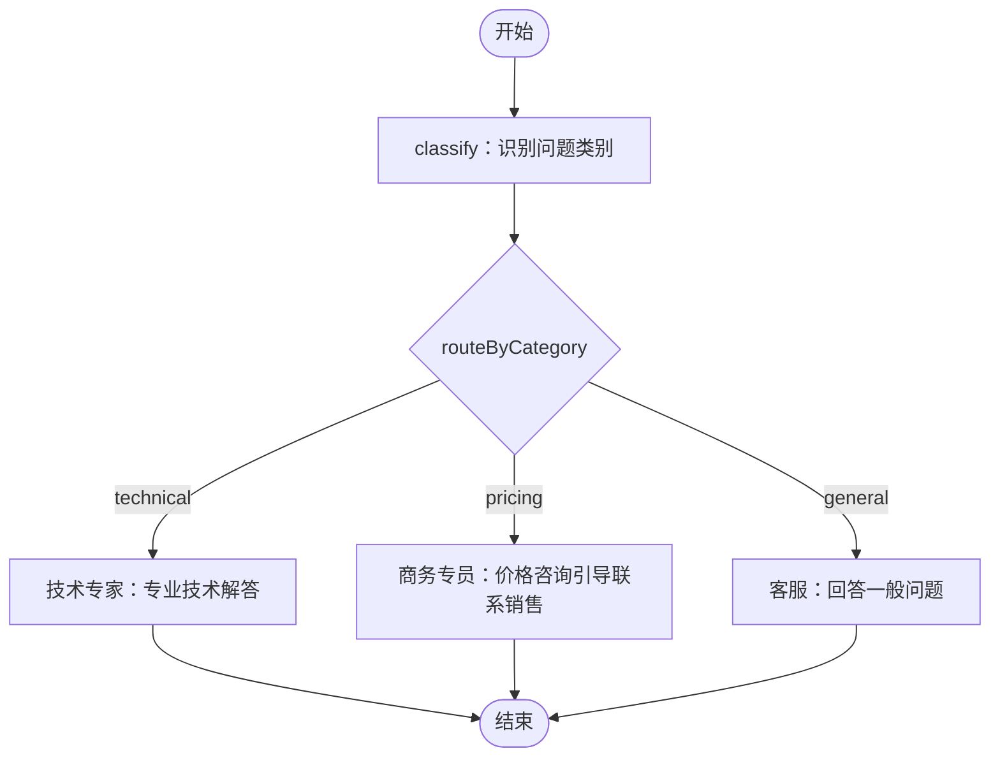
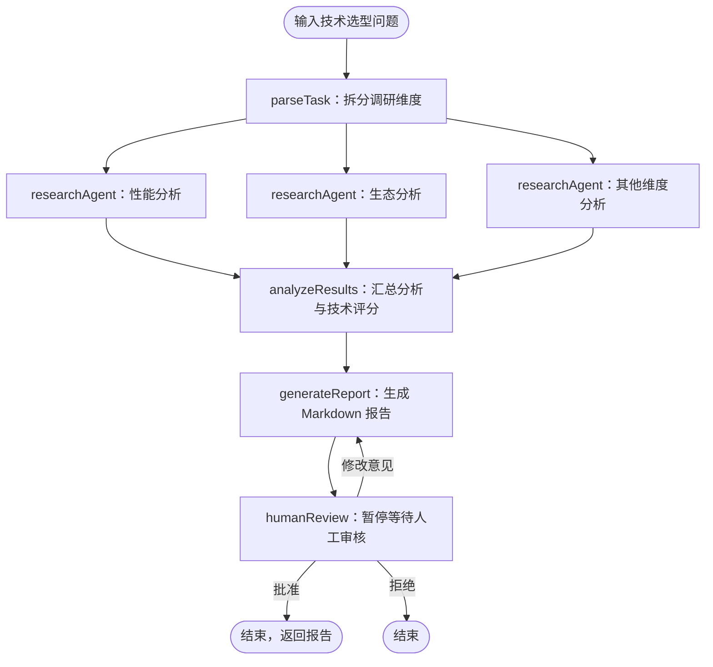

- 知识库访问权限校验，不能仅凭传入集合名访问。
- 文档更新、去重和删除。
- 模型及版本记录，避免混用向量。
- 检索相关性过滤、重排和引用来源。
- 状态查询、清空等管理能力。

# 混淆的点

- tool,function_calling,mcp
- lang_chain与lang_graph历史记录的区别

# 分类路由

`一个任务拆解多任务并行 VS 多个subagent进行的区别`

# tech-research

